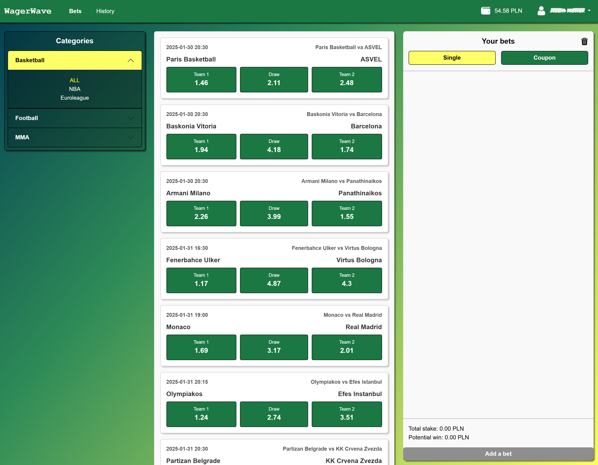
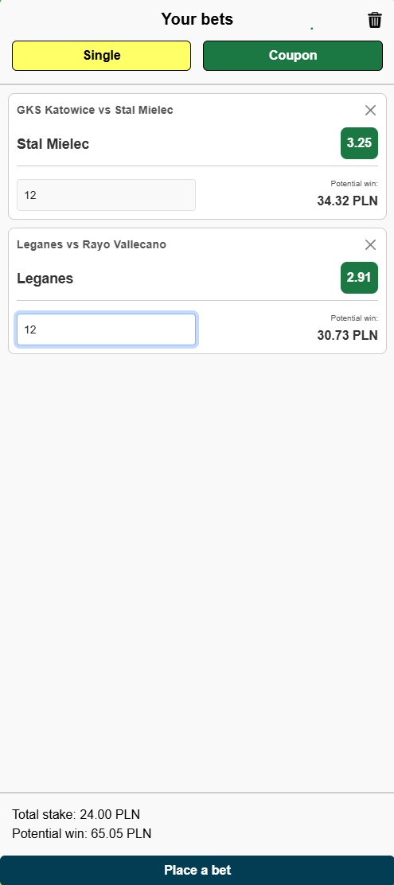
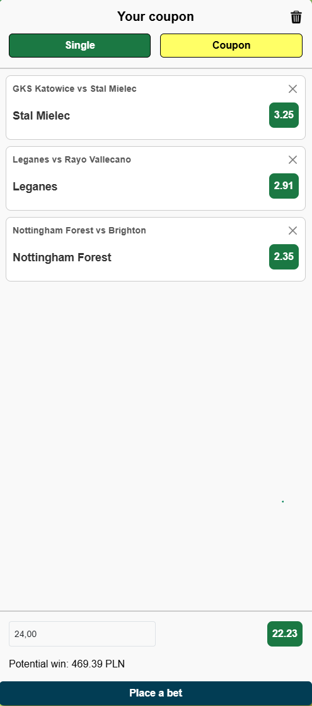
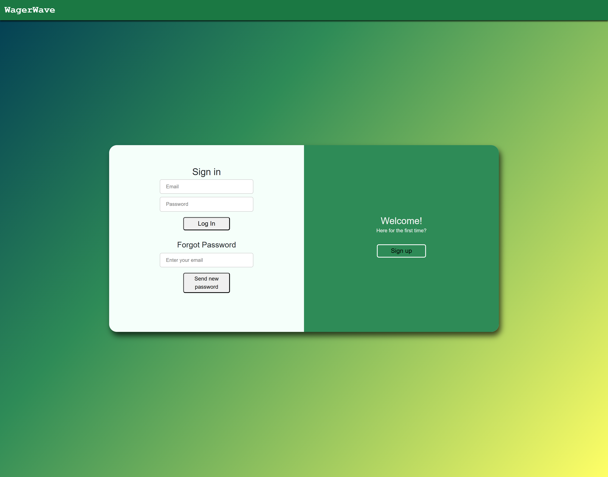
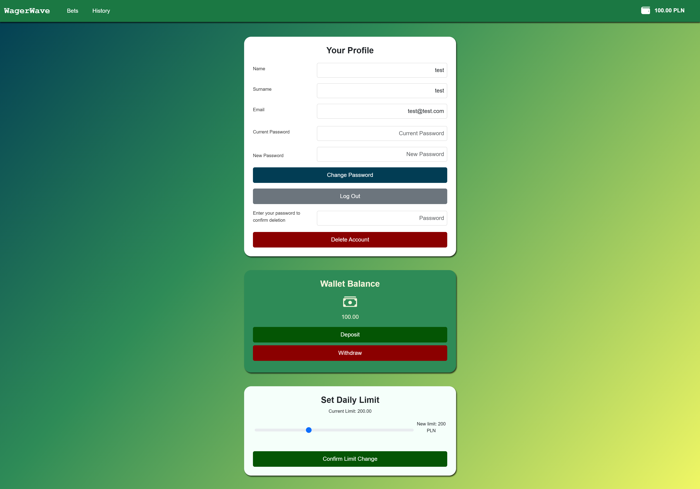
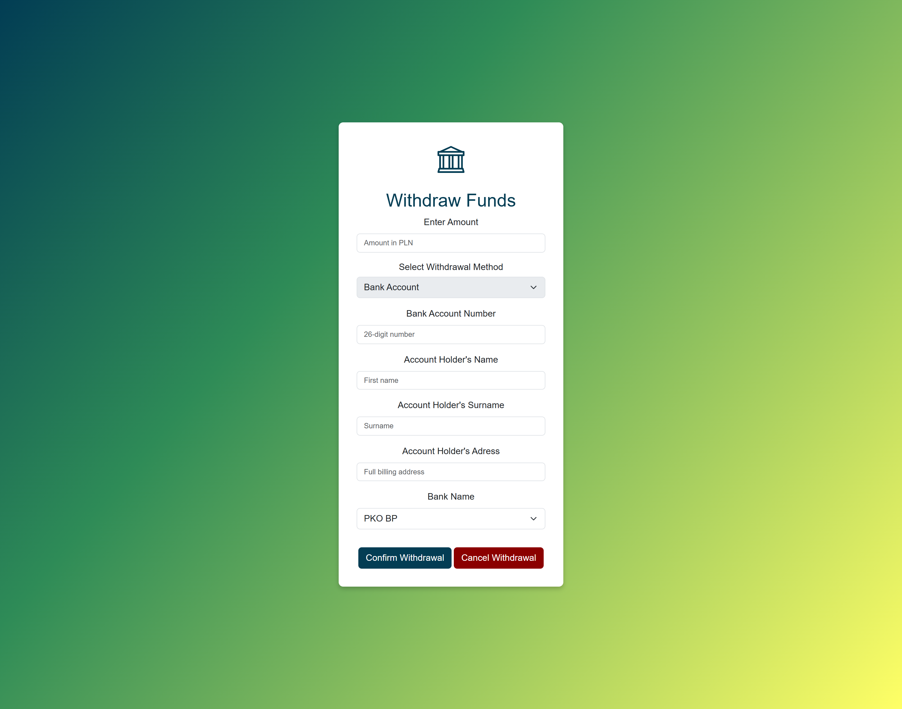
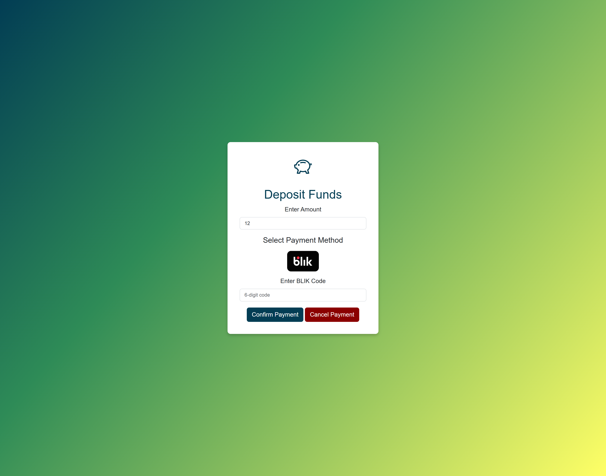
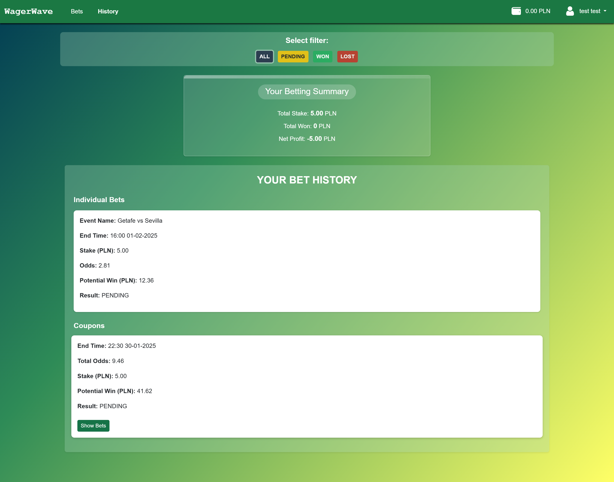

# WagerWave

**Authors: A. Nowak, K. Nawrocki, E. Madetko**

WagerWave is a modern, user-friendly web application designed to let users bet on their favorite teams. We offer a variety of services, including single and combo bets, secure registration, easy deposits (with BLIK simulation), and withdrawals to your bank account. What sets us apart from other well-known betting sites is our commitment to responsible gambling.
Our unique features include:

- Access to your entire betting history and historical balance, enabling users to see their performance over time.
- Daily deposit limits of up to 500 to prevent users from quickly losing large sums of money.

We believe in promoting responsible gambling habits. By allowing users to view their entire betting history, we encourage self-awareness and help them recognize potential gambling addiction. When users see how much money they have lost, they are more likely to make informed decisions and avoid chasing losses.

## Technologies 
The project was developed using followed technologies:
### Front-end: 

- **HTML5, CSS3, JavaScript**: Core technologies for building a responsive and interactive user interface.
- **Bootstrap, Media Queries**

### Back-end: 
- **SpringBoot Framework**: 
  - **Spring Web**: A module for building RESTful APIs and handling HTTP requests.
  - **Spring Data JPA**: An abstraction over Hibernate that streamlines database interactions using repository-based access.
  - **Spring Security**: authentication and authorization framework ensuring secure access control.
  - **Spring WebClient**: A non-blocking, reactive HTTP client used for making asynchronous API calls, replacing the traditional RestTemplate. It supports reactive programming and efficient handling of external service communication.
  - **Spring WebFlux**: supports reactive programming.
  - **Spring Mail**: Facilitates sending emails.
  - **WebSocket**: Enables real-time, full-duplex communication between the client and server, essential for features like live betting updates.
  - **Spring Validation**: Ensures data integrity and security by validating user input in requests.

- **Rendering & API Structure**:
  - **Thymeleaf**: Used for server-side rendering of dynamic views, such as login pages, account details, and history pages.
  - **REST API**: Used for dynamic content updates and operations, including bet creation, coupon management, and fetching currently available matches for the homepage.

- **Database & Migrations**:
  - **MySQL**: The database used, hosted on Aiven.io (with plans to migrate to PostgreSQL).
  - **Flyway**:  A database migration tool that ensures version-controlled and consistent schema updates.

- **API & MAIL**: 
  - **API-basketball**: (https://api-sports.io/) : Provides real-time data on basketball and football matches, enabling live updates and betting opportunities.
  - **SMTP (Gmail)**: Used for sending emails, including password recovery and account notifications.

## Requirements: 
- **JDK**: 17 or later
- **Spring Boot 3.3.4t**
- **MySQL 8.40 or higher**
- **Maven**
- **API keys**: https://api-sports.io/
- **Gmail Mail Sender**: mail and password

## Authors & Responsibilities:
- **A. Nowak**: 
  - All Back-end development (except history controller).
  - Integrating third-party APIs (e.g., API-Basketball) to fetch live available matches and their results, as well as implementing RESTful APIs for bet creation, match fetching, and updating bet results and coupons based on live match data from API-Basketball.
  - Security: Implementation of Spring Security for user authentication and authorization.
  - Email system: Configuring and managing SMTP Gmail for sending system emails (e.g., password recovery).
  - Front-end: Registration, Account, Deposit, Withdrawal pages. 
  - Database management: Handling all database operations (except schema, documentation, and models), including managing data retrieval, updates, and optimization of queries for efficient performance.

- **K. Nawrocki**: 
  - Database management: Schemas, models, documentation.
  - Front-end: MAIN PAGE: including presenting events and their details (e.g., matches, betting odds), handling user interactions, and ensuring the dynamic and responsive display of available betting options and enabling the creation of coupons and single bets.

  
- **E. Madetko**: 
  - Front-end: History page (e.g., displaying user's bets, coupons, and net profit, including filtering options for past bets and displaying detailed results).
  - Back-End: History Controller, responsible for filtering and managing bets and coupons (e.g., won, lost, pending). 

## App view: 
### Main Page: 

#### Betting:

### Registration and login:

### Account Page: 

### History: 

